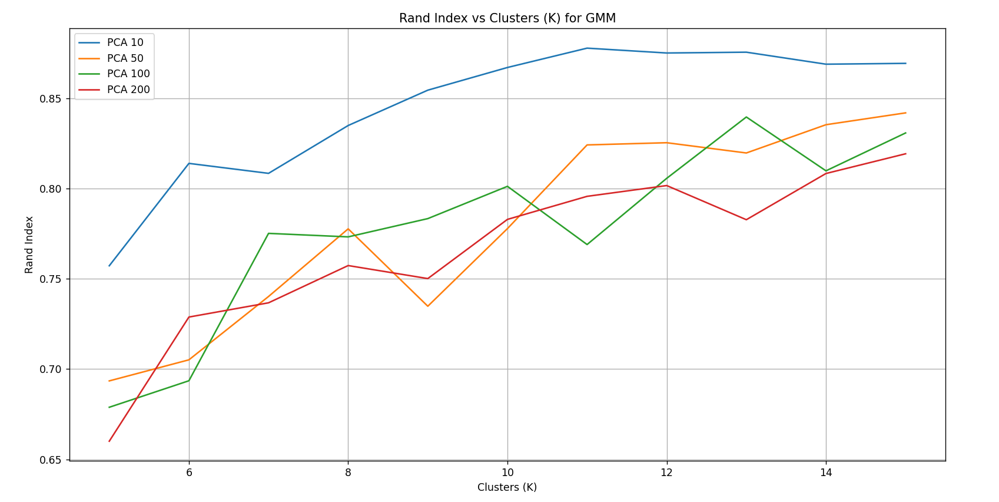
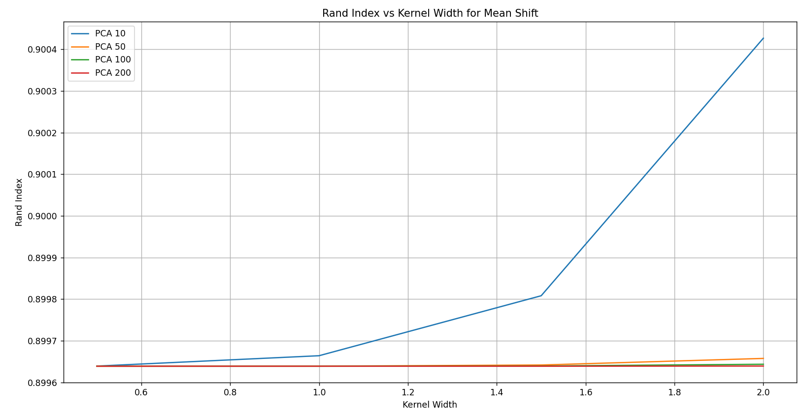
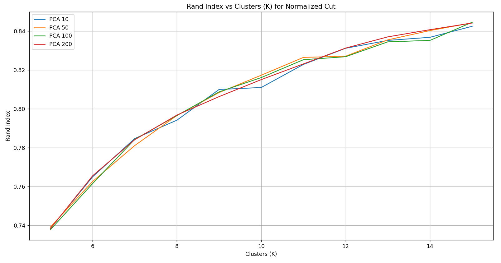
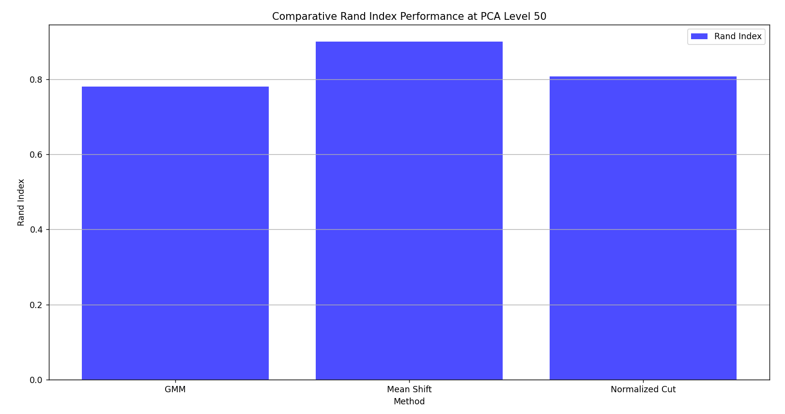

# Artificial Intelligence Clusters 🧩

> Unsupervised Learning on MNIST Handwritten Digits

[](https://www.python.org/)
[](http://yann.lecun.com/exdb/mnist/)
[](https://en.wikipedia.org/wiki/Cluster_analysis)
[](Report.pdf)

## Table of Contents

- [Artificial Intelligence Clusters 🧩](#artificial-intelligence-clusters-)
  - [Table of Contents](#table-of-contents)
  - [🔍 Overview](#-overview)
  - [✨ Project Highlights](#-project-highlights)
  - [🧪 Implemented Techniques](#-implemented-techniques)
    - [Principal Component Analysis (PCA)](#principal-component-analysis-pca)
    - [Gaussian Mixture Model (GMM)](#gaussian-mixture-model-gmm)
    - [Mean Shift](#mean-shift)
    - [Normalized Cut](#normalized-cut)
    - [Rand Index](#rand-index)
  - [🚀 Getting Started](#-getting-started)
  - [📊 Results Visualization](#-results-visualization)
    - [Performance Analysis](#performance-analysis)
  - [📂 Output Structure](#-output-structure)
    - [Data Files](#data-files)
    - [Visualization Files](#visualization-files)

## 🔍 Overview

This project explores the powerful domain of unsupervised machine learning through clustering analysis on the MNIST handwritten digit dataset. Developed during my exchange studies at the University of Italy in December 2024, it demonstrates how different clustering algorithms can discover intrinsic patterns and group similar handwritten digits without any labeled training data.

## ✨ Project Highlights

- **Unsupervised Pattern Recognition**: Discovering natural groupings in visual data without labeled examples
- **Dimensionality Reduction**: Applying PCA to reduce computational complexity while preserving information
- **Multiple Clustering Approaches**: Implementation and comparison of three distinct clustering techniques
- **Performance Evaluation**: Quantitative assessment using Rand Index scoring
- **Visual Analysis**: Comprehensive visualization of clustering performance across parameters

## 🧪 Implemented Techniques

The project implements a comprehensive suite of clustering and analysis methods:


### Principal Component Analysis (PCA)
- **Purpose**: Dimensionality reduction to improve computational efficiency
- **Implementation**: Transforms high-dimensional MNIST data to lower-dimensional space
- **Benefits**: Preserves most significant information while reducing computational load

### Gaussian Mixture Model (GMM)
- **Approach**: Probabilistic model assuming data generated from mixture of Gaussian distributions
- **Strengths**: Soft clustering with probability assignments to multiple clusters
- **Parameters**: Configurable number of clusters (K)

### Mean Shift
- **Approach**: Non-parametric algorithm that finds density modes in data
- **Strengths**: Automatically determines number of clusters based on data density
- **Parameters**: Kernel width (bandwidth) controlling cluster granularity

### Normalized Cut
- **Approach**: Graph-based clustering using spectral properties of similarity matrix
- **Strengths**: Effective at capturing complex cluster shapes and relationships
- **Parameters**: Number of clusters (K)

### Rand Index
- **Purpose**: Evaluation metric for clustering quality
- **Measurement**: Agreement between clustering results and ground truth
- **Range**: 0 (random clustering) to 1 (perfect agreement)

## 🚀 Getting Started

1. Clone the repository
2. Install dependencies:
   ```bash
   pip install -r requirements.txt
   ```
3. Configure execution mode in `main.py`:
   ```python
   # To generate new clustering results
   run_models(True)  # Set to False to skip execution
   
   # To visualize existing results
   visualize_results(True)  # Set to False to skip visualization
   ```
4. Run the main script:
   ```bash
   python main.py
   ```

## 📊 Results Visualization

### Performance Analysis

Our analysis reveals significant performance differences between clustering methods across various parameters:

**Gaussian Mixture Model Performance:**

*GMM performance with varying PCA dimensions and cluster counts*

**Mean Shift Performance:**

*Mean Shift performance with different bandwidth parameters and PCA dimensions*

**Normalized Cut Performance:**

*Normalized Cut performance across cluster counts and PCA dimensions*

**Comparative Analysis:**

*Average Rand Index scores across all clustering methods*

## 📂 Output Structure

The system generates structured output in two categories:

### Data Files

The `/output/data` directory contains JSON files with comprehensive performance metrics:

```
output/
├── data/
│   ├── gmm_results.json
│   ├── mean_shift_results.json
│   └── normalized_cut_results.json
```

All results follow a standardized schema defined in `schemas.yml`, with parameter distinctions:
- **Cluster-based methods** (GMM, Normalized Cut): Configured by K (cluster count)
- **Density-based methods** (Mean Shift): Configured by kernel width (bandwidth)

### Visualization Files

The `/output/visualization` directory contains PNG visualizations generated from result data:

```
output/
└── visualization/
    ├── gmm_rand_index.PNG
    ├── mean_shift_rand_index.PNG
    ├── normalized_cut_rand_index.PNG
    └── rand_index_method_avg_comparison.PNG
```

These visualizations provide intuitive understanding of clustering performance across various parameters and methods.

---

*Developed as part of advanced machine learning research in unsupervised clustering techniques.*